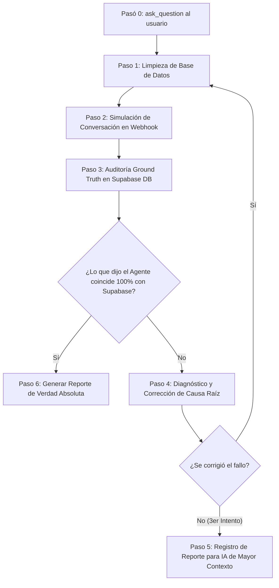

# Protocolo de Pruebas y Auditoría Ground Truth para Agentes n8n (Melosmile)

Este documento define el procedimiento operativo estándar (SOP) para ejecutar pruebas integrales sobre el sistema multi-agente de n8n y Next.js/Vercel en Melosmile.

---

## 🛑 PASO 0: Consulta Obligatoria de Preferencias al Usuario (HITL Gate)

**ANTES DE EJECUTAR CUALQUIER ACCIÓN O SCRIPT EN EL SISTEMA, EL AGENTE DEBE DETENERSE Y PREGUNTAR AL USUARIO SU PREFERENCIA MEDIANTE `ask_question`.**

Preguntas obligatorias:
1. **Escenario de Prueba**: ¿Qué flujo se va a probar? (Ej: *Agendar nueva cita*, *Modificar cita existente*, *Cancelar cita*, *Consultar disponibilidad*).
2. **Paciente / Entidad de Prueba**: ¿Con qué paciente se hará la prueba? (Ej: *Manuel Cardama*, *Crear paciente nuevo*, *Paciente existente específico*).
3. **Modo de Simulación**: ¿Se prefiere simulación automática vía Webhook curl o pruebas con interacción guiada paso a paso?

---

## 🔄 PASO A PASO DEL FLUJO DE EVALUACIÓN

---

### Paso 1: Preparación y Limpieza del Estado Inicial
1. Obtener los identificadores clave de la prueba (URL Supabase: `https://amhfdzfcmpastmlsosou.supabase.co`, Service Role Key).
2. Ejecutar un script de limpieza para eliminar citas o registros de facturación anteriores del paciente de prueba.
3. **Validación de Punto Cero**: Confirmar mediante consulta SDK que existen `0` citas para la prueba antes de enviar el primer mensaje.

---

### Paso 2: Simulación de Conversación Realista (Sin Forzar Datos)
1. Enviar el primer mensaje del flujo al Webhook de n8n Dispatcher:
   `POST https://n8n.mumaweb.com/webhook/melosmile-dispatcher`
2. **Evaluación de Respuestas Intermedias**:
   - Si el agente solicita aclaraciones (hora, sede, profesional, tratamiento), responder con la información solicitada sin forzar estructuración sintética.
   - Preservar el `history` y `sessionId` de la conversación para simular una sesión real.
3. Capturar la respuesta JSON final emitida por n8n (`status`, `intent`, `extracted_entities`, `summary`).

---

### Paso 3: Auditoría Ground Truth en Supabase DB
**REGLA DE ORO**: Nunca declarar éxito basándose únicamente en el texto de confirmación devuelto por el agente (`summary`).

Verificar contra la base de datos real utilizando la `service_role_key`:
1. **Conteo exacto**: Verificar el número exacto de filas creadas en `appointments`.
2. **Estatus obligatorios**:
   - Por norma del negocio, todas las citas nuevas deben registrarse en estado **`Pendiente`** (salvo especificación explícita en contrario).
3. **Mapeo de Relaciones**:
   - `patient_id` => UUID correcto del paciente.
   - `clinic_id` => UUID de la clínica solicitada.
   - `professional_id` => UUID del profesional asignado (Dra. Osly Melo por defecto).
   - `treatment_id` => UUID del tratamiento catálogo (ej: Control de Ortodoncia).
4. **Validación Financiera en `billing_records`**:
   - Verificar que se creó el registro de facturación correspondiente.
   - Verificar `custom_price` (debe coincidir con el precio de catálogo de la ficha del tratamiento).
   - Verificar `calculated_total` (neto calculado con comisión y laboratorio).
   - Verificar `status: "Pendiente"`.

---

### Paso 4: Manejo de Fallos e Iteración
Si la auditoría en Supabase no coincide al 100% con lo informado por el agente:

1. **Clasificación del Fallo**:
   - **Fallo de LLM en n8n**: El modelo no llamó a la herramienta o respondió sin ejecutar el HTTP node.
   - **Fallo de Mapeo API / Vercel**: Parámetros nulos, error 500, o problemas de deserialización JSON.
   - **Fallo de RLS / Permisos Supabase**: Claves anónimas usadas en lugar de service role o errores de asincronía (`.insert(...).select()`).
2. **Inspección de Logs**:
   - Consultar la API de ejecuciones de n8n (`GET /api/v1/executions/{executionId}?includeData=true`).
   - Revisar tracebacks y HTTP Status codes de Vercel/Next.js Route Handlers.
3. **Aplicación de Corrección**:
   - Aplicar el fix en las rutas de Next.js o en el workflow JSON de n8n.
   - Compilar (`npm run build`), hacer push a git (`develop`/`main`) y sincronizar con n8n PUT API.
4. **Re-ejecución del Test**:
   - Volver al **Paso 1** (limpiar estado en Supabase) y repetir la simulación.

---

### Paso 5: Registro del Fallo para Escalado (IA de Mayor Contexto)
Si un fallo no se resuelve tras **3 iteraciones** o involucra decisiones arquitectónicas complejas:
1. Crear un artefacto de diagnóstico en la carpeta del proyecto.
2. Incluir:
   - Resumen del problema y comportamiento esperado vs. real.
   - Payload enviado al Webhook.
   - ID y logs completos de la ejecución de n8n.
   - Estado de las tablas en Supabase DB.
   - Fragmentos de código involucrados en Next.js / n8n.

---

### Paso 6: Generación del Reporte Final de Verdad Absoluta
Una vez verificado con éxito, presentar al usuario una tabla de cotejo final:

| Parámetro Evaluado | Respuesta del Agente IA | Estado en Supabase DB Ground Truth | Coincidencia |
| :--- | :--- | :--- | :---: |
| Intent / Acción | `schedule_appointment` | Cita Insertada | ✅ |
| Conteo de Citas | "He agendado 1 cita..." | `1` fila creada | ✅ |
| Estado Cita | N/A | `"Pendiente"` | ✅ |
| Paciente | Manuel Cardama | `3dc5468d-1b0e-4b4b-8c2d-219c7184d361` | ✅ |
| Clínica | RyA | `0da2b67b-66c9-42a0-83a3-232d93d45221` | ✅ |
| Tratamiento | Control de Ortodoncia | `d21a1b1a-0fc7-426a-87f3-10149f0a3d1f` (60€) | ✅ |
| Facturación | N/A | Row en `billing_records` (60€ / 36€ neto) | ✅ |
