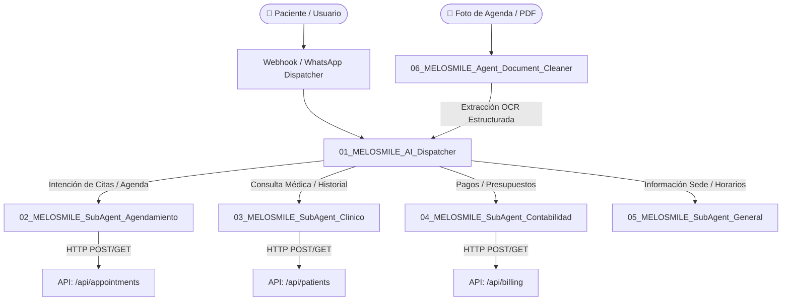

# 🤖 Dominio: Arquitectura y Contratos de Workflows n8n (Melosmile)

Este documento describe la topología, contratos, flujos y endpoints que componen el sistema multi-agente de **Melosmile** en n8n.

---

## 1. Topología General del Sistema Multi-Agente

El sistema de Melosmile sigue el patrón **AI Dispatcher & Tool Workflows**, donde un agente central clasifica la intención del usuario y delega la ejecución a sub-agentes especializados:



---

## 2. Catálogo de Flujos y Fichas Técnicas

### `01_MELOSMILE_AI_Dispatcher`
* **ID en n8n:** `Yv9X1EGUvQg8qErW`
* **Rol:** Orquestador principal de mensajes entrantes (WhatsApp / Web / Chatbot).
* **Entrada:** Payload de mensaje con `sessionId`, `userMessage`, `phone_number`.
* **Herramientas (Tool Workflows Conectados):**
  * `toolWorkflow_Agendamiento` (ID: `jTWHg9bHaNOdzL13`)
  * `toolWorkflow_Clinico` (ID: `Q7oxrbUuohca81Gn`)
  * `toolWorkflow_Contabilidad` (ID: `XSLNwq6ihH1SHPRl`)
  * `toolWorkflow_General` (ID: `MIok0ruU7JhpTxWv`)

---

### `02_MELOSMILE_SubAgent_Agendamiento` (v2)
* **ID en n8n:** `vg2HrtIQpvDrcUOC` (el antiguo `jTWHg9bHaNOdzL13` está obsoleto)
* **Rol:** Gestión del ciclo de vida de citas y disponibilidad + alta/consulta de pacientes.
* **Tools internas:** `Tool_List_Appointments`, `Tool_Appointment_Manager` (crear → helper `BTJZSpohjoxeY5Ru`), `Tool_Update_Appointment` (modificar/cancelar → helper `MlrysSNd3N8tDjVh`), `Tool_Create_Patient`, `Tool_Search_Patients`.
* **Semántica de estados obligatoria:** anular/cancelar ⇒ `{"appointment_id","status":"Cancelada"}` (soft-delete). El borrado físico (`delete_appointment:true`) solo si el usuario lo pide literalmente — de lo contrario se pierden las citas y sus `billing_records` asociados.
* **Jerarquía de fechas:** el subagente inyecta su propio `$now` (Europe/Madrid) en el prompt y prevalece sobre cualquier fecha que el dispatcher le pase; fechas relativas ("el viernes") siempre hacia adelante desde HOY real.

---

### `03_MELOSMILE_SubAgent_Clinico`
* **ID en n8n:** `Q7oxrbUuohca81Gn`
* **Rol:** Consulta y registro de evolución médica.
* **Endpoints de Melosmile Vinculados:**
  * `GET /api/patients/{id}` (Ficha y antecedentes)
  * `POST /api/patients/{id}/notes` (Evolución clínica)
* **Regla Estricta:** Las observaciones no facturables (ej: *Poner ataches, IPR*) se registran estrictamente en el campo `notes` y no como citas o cobros separados.

---

### `04_MELOSMILE_SubAgent_Contabilidad`
* **ID en n8n:** `XSLNwq6ihH1SHPRl`
* **Rol:** Consulta de cobros pendientes (Odoo deshabilitado por decisión del usuario hasta certificar el sistema básico).
* **Tools internas:** `Tool_Consultar_Cobros` → helper determinista `[MELOSMILE] Helper - Billing Query` (`AzGmCQ5rd7gvEQ3w`: busca paciente + consulta `/api/billing/pending` y devuelve `{found, paciente, num_pendientes, pendientes[{concepto,importe,estado}], total_pendiente}`), `Tool_Search_Patients`, `Tool_Reminders_Dispatcher`.
* **Patrón clave:** las cadenas multi-paso (buscar UUID + consultar) se encapsulan en helpers deterministas de un solo tool-call; el LLM nunca encadena dos llamadas HTTP (gemini-flash saltaba el segundo paso ~50% de las veces).
* **Contrato API:** `/api/billing/pending?patient_id={uuid}` devuelve registros con `appointment_reason` y `total_amount` (mapeados desde `billing_records.calculated_total ?? custom_price` vía join `appointments!inner`). `billing_records` NO tiene columnas patient_id/total_amount.

### Helpers atómicos (patrón Execute_Workflow_Trigger → Parse → HTTP → Format)
| Helper | ID | Función |
|---|---|---|
| Helper - Patient Search | `ungEfZO2qzDQvuVC` | Búsqueda fuzzy de pacientes |
| Helper - Appointment Create | `BTJZSpohjoxeY5Ru` | Alta de cita |
| Helper - Appointment Modify | `MlrysSNd3N8tDjVh` | Update/cancel (forward JSON puro) |
| Helper - Billing Query | `AzGmCQ5rd7gvEQ3w` | Cobros pendientes combinados |

---

## 3bis. Patrones Técnicos Obligatorios (lecciones certificadas 2026-08-23)
1. **Conexiones ai_tool:** el formato nativo correcto va del TOOL al AGENTE: `connections["Tool_X"].ai_tool=[[{"node":"Agent_X","type":"ai_tool","index":0}]]`. Escribirlo invertido (agente→tools) lo acepta la API pero el runtime lo ignora silenciosamente.
2. **toolHttpRequest tv1.1 binding:** los argumentos del modelo se bindean con expresiones inline `{{ $fromAI('param','descripción') }}` en url/jsonBody. El estilo `{placeholder}`+`placeholderDefinitions` NUNCA bindea. Además `sendHeaders:true` es obligatorio o los headers no se envían (401 silencioso).
3. **toolWorkflow:** usar SIEMPRE `typeVersion:1`, `"source":"database"` y `workflowId` como STRING plano (no objeto `__rl`). tv1.2 rompe el bindeo de argumentos.
4. **Forense de ejecución:** si `runData` no contiene nodos `Tool_*`, la herramienta nunca se ejecutó (aunque el LLM responda con confianza). El runData del agente NO persiste definiciones de tools.
5. **Publicación segura:** deactivate → sleep(2) → PUT → activate → GET-verify. Un PUT sin ciclo puede dejar stale defs activas.
6. **Dispatcher:** PROHIBIDO que resuelva fechas relativas (aritmética errónea de flash); pasa texto verbatim, el subagente usa su `$now`.
7. **Modelo en n8n producción:** `google/gemini-2.5-flash` vía OpenRouter es el único validado E2E en esta instancia (los 3.x no están disponibles ahí).

---

### `05_MELOSMILE_SubAgent_General`
* **ID en n8n:** `MIok0ruU7JhpTxWv`
* **Rol:** Respuestas a preguntas frecuentes sobre ubicación, horarios y profesionales de las clínicas (Albacete / Albi).

---

### `06_MELOSMILE_Agent_Document_Cleaner`
* **ID en n8n:** `OG4Yy4N7qALXojTa`
* **Rol:** Extracción OCR y limpieza de imágenes de agendas manuscritas.
* **Salida:** JSON estructurado listo para inserción en base de datos.

---

## 3. Estándares de Seguridad y Autenticación
Todas las peticiones HTTP que los nodos de n8n envían hacia la API de Melosmile (`https://melosmile-staging-git-develop-proyectosmuma-stacks-projects.vercel.app`) deben incluir la cabecera:
```http
x-api-key: melosmile_internal_n8n_key_2026
Content-Type: application/json
```

## 4. Credenciales de IA y Modelos LLM (Gotchas Operativos)
- **Credencial de OpenRouter en n8nv2:** ID `4nco5fDnIohG6g9f` (nombre `"OpenRouter account"`) está activa y configurada en `https://n8nv2.mumaweb.com`.
- **Gotcha de Modelos:** Si un flujo falla en `OpenRouter_Chat_Model` con error de ejecución, comprobar el parámetro `model`. Los modelos `google/gemini-2.5-*` fueron deprecados por Google. Deben configurarse modelos vigentes (`google/gemini-3.6-flash` o `google/gemini-3.1-pro-preview`).

## 5. Regla Anti-Bucles de Diagnóstico E2E (Protocolo de 3 Capas Aisladas)
Queda estrictamente prohibido el patrón de "ensayo-error acoplado" (hacer 1 cambio menor -> lanzar E2E completo -> fallar -> repetir) en los agentes conectados a n8n.
Cuando un flujo o integración multi-agente falle en pruebas E2E, se DEBE seguir obligatoriamente este orden secuencial (cristalizado en el grafo de RAG y las reglas maestras):

### CAPA 1 — Infraestructura y Transporte (Bulk Fix & Pure Plumbing)
1. **Auditoría Exhaustiva de Nodos:** Inspeccionar TODOS los nodos y herramientas del flujo en una sola pasada.
2. **Bulk Configuration:** Aplicar flags obligatorios (`sendHeaders: true`, content-types, auth headers) a TODOS los nodos en un solo PUT/Update masivo.
3. **Validación en Seco (Unit Tests / Curl):** Verificar directamente contra los endpoints HTTP que devuelven `200 OK` antes de involucrar al LLM.

### CAPA 2 — Orquestación y Prompts (Contratos de Delegación)
1. **Endurecimiento de Reglas:** Prohibir explícitamente al Dispatcher/Supervisor responder con texto o JSON inventado; forzar la invocación de la herramienta/sub-workflow.
2. **Aislamiento de Nodos Deshabilitados:** Nunca dejar nodos deshabilitados conectados al grafo del agente LangChain (provoca bucles ciegos).

### CAPA 3 — Certificación E2E Única y Verdad Absoluta
1. **Un Solo Test de Integración:** Ejecutar el test E2E completo únicamente tras verificar la Capa 1 y Capa 2.
2. **Verdad Absoluta en BD:** Comprobar siempre el registro real en la base de datos, nunca fiarse del texto de "éxito" devuelto por el LLM.
